# FalconPlan

FalconPlan is a compact, test-driven autonomous-driving planning and decision
portfolio. It connects coordinate and vehicle-model foundations to predictive
behavior planning and a collision-aware Frenet lattice planner. The code is
deliberately small enough to review in an interview while preserving explicit
interfaces, constraints, failure cases, and reproducible demos.

## Why this project

Planning software fails at layer boundaries as often as it fails inside an
algorithm. FalconPlan therefore treats frames, state ownership, actuator
semantics, feasibility filters, and collision checks as first-class engineering
concerns rather than presenting a single isolated planner notebook.

## Architecture / pipeline

```mermaid
flowchart LR
    E[Road reference and traffic state] --> B[Prediction and behavior]
    B --> S[Lane, speed, and horizon sampling]
    S --> F[Frenet trajectory generation]
    F --> C[Dynamic and curvature constraints]
    C --> W[Frenet-to-World projection]
    W --> O[Static-obstacle collision filter]
    O --> R[Cost ranking and selected trajectory]
    R --> V[Vehicle model / HAL validation]
```



The behavior layer decides among keep-lane, following, lane-change, and
emergency states. The W04 planner converts lane and speed objectives into a
set of time-parameterized motion candidates, rejects unsafe or infeasible
candidates, and returns the lowest-cost World-frame trajectory.

## Implemented features

- **Coordinate foundation:** World, Body, and Frenet states; continuous
  reference-line interpolation; round-trip transforms and singularity guards.
- **Vehicle model and HAL:** rear-axle kinematic bicycle model, Euler/RK4
  integration, bounded commands, and switchable simulator/mock-hardware
  adapters with CAN-like actuator semantics.
- **Predictive behavior planning:** finite-state behavior control, CV/CA motion
  prediction, TTC/THW risk assessment, IDM longitudinal control, and MOBIL lane
  change safety/incentive evaluation.
- **Frenet lattice planning:** quintic lateral and quartic longitudinal
  polynomials, lane-aware lateral sampling, target-speed and duration sampling,
  kinematic feasibility checks, World projection, curvature constraints,
  circular-obstacle collision checking, and weighted cost selection.
- **Regression evidence:** deterministic unit, numerical, integration, and
  planner-level tests, including blocked-candidate fallback behavior.

## Key algorithms

### Predictive behavior layer

The behavior planner evaluates current and predicted risk, obtains a bounded
longitudinal acceleration from IDM, and uses MOBIL to reject unsafe or
low-benefit lane changes. Hysteresis counters keep the FSM from switching on a
single transient frame.

### Frenet lattice planner (W04)

A grid search returns a sequence of occupied/free cells. FalconPlan's current
planner solves a different problem: it samples motion candidates over lateral
offset, terminal speed, and duration. Each candidate is a continuous-time
Frenet trajectory built from boundary-conditioned polynomials. Candidates are
then projected to World coordinates and checked for acceleration, jerk,
curvature, and static-obstacle clearance before ranking.

```text
motion objective
  -> (target d, target speed, duration) samples
  -> polynomial trajectory candidates
  -> Frenet dynamic constraints
  -> World projection and curvature constraints
  -> collision filter
  -> weighted cost ranking
```

This is useful for lane-level driving motion where smooth state evolution and
vehicle constraints matter. FalconPlan does **not** currently implement a
generic occupancy-grid A*/Dijkstra planner; grid-search navigation remains
roadmap work rather than a claimed feature.

## Representative W04 result

Fresh run on Python 3.10.11 / Windows using
`python -m demos.lattice_planner_demo`:

| Scenario | Generated | Frenet feasible | World feasible | Collision-free | Selected result |
| --- | ---: | ---: | ---: | ---: | --- |
| Normal left-lane objective | 72 | 52 | 52 | 52 | `d=3.5 m`, `v=25.0 m/s`, `T=3.5 s`, max `|kappa|=0.007797 1/m` |
| Obstacle on original best | 72 | 52 | 52 | 20 | collision-free fallback at `d=0.0 m`, `v=25.0 m/s`, `T=2.5 s` |

The second scenario places a circular obstacle on the original best trajectory.
The planner rejects that candidate and selects a safe fallback; it does not
silently weaken collision constraints to preserve the preferred lane change.
Counts and floating-point values are scenario-specific, not universal
performance claims.

## Project structure

```text
behavior/            prediction, safety metrics, FSM, IDM, MOBIL, orchestration
coordinate_system/   reference line and World/Body/Frenet transformations
planning/            polynomials, lattice generation, filters, collision, cost
vehicle_model/       vehicle types and kinematic bicycle dynamics
hal/                 backend-neutral vehicle interface and test adapters
demos/               focused and integrated executable examples
tests/               unit, numerical, integration, and planner regression tests
docs/                architecture, conventions, and scope boundaries
```

## Quick start

Python 3.10 or newer is required.

```bash
python -m venv .venv
```

Windows PowerShell:

```powershell
.venv\Scripts\Activate.ps1
python -m pip install -e ".[dev]"
```

Linux / macOS:

```bash
source .venv/bin/activate
python -m pip install -e ".[dev]"
```

## Run tests

```bash
python -m pytest -q
```

Release regression: **312 tests passed** on Python 3.10.11.

## Run demos

```bash
python -m demos.behavior_planner_demo
python -m demos.lattice_planner_demo
python -m demos.world_trajectory_demo
python -m demos.adapter_switch_demo
```

The planning demos open Matplotlib figures when an interactive backend is
available. For CI or headless validation, set `MPLBACKEND=Agg`.

## Engineering notes

- Frame and unit conventions are explicit: metres, seconds, m/s, m/s^2, and
  radians; positive lateral Frenet offset is left of the reference line.
- Collision checking uses swept trajectory segments against circular obstacles
  with configurable vehicle radius and safety margin, not only sampled-point
  equality.
- Feasibility and ranking are separate. Hard speed/acceleration/jerk/curvature
  and collision constraints run before soft cost comparison.
- The mock HAL validates abstraction and actuator semantics; it is not a real
  CAN driver or a production safety interface.
- The current lattice demo handles static obstacles known at planning time.
  Dynamic prediction, online replanning, and closed-loop path tracking are not
  yet integrated into FalconPlan.

## Roadmap

- Add a closed-loop trajectory tracker and measure tracking error against the
  selected World-frame trajectory.
- Add occupancy-grid search as a separate geometric baseline where appropriate.
- Connect behavior outputs to repeated online trajectory planning in a rolling
  horizon loop.
- Introduce dynamic obstacle prediction and time-aware collision checking.
- Add richer vehicle footprint and dynamic-model constraints before any
  simulator or hardware-in-the-loop claim.

See [docs/architecture.md](docs/architecture.md) for contracts and limitations.
