# FalconPlan

**A compact, test-driven autonomous-driving stack that connects prediction,
behavior planning, collision-aware motion planning, closed-loop control, vehicle
dynamics, and hardware abstraction in one reviewable Python codebase.**


FalconPlan is a portfolio project for exploring the engineering boundaries
between autonomous-driving algorithms. Rather than presenting isolated
notebooks, it carries explicit state, frame, constraint, and actuator contracts
through an end-to-end pipeline—from surrounding-vehicle prediction to the
command applied to a vehicle model.

The implementation is intentionally small enough to inspect in an interview,
while still exposing the failure modes that matter in a real stack: unsafe lane
changes, infeasible trajectories, obstacle collisions, actuator saturation,
command delay, controller instability, and backend coupling.

## What is implemented

| Layer | Algorithms and components | Engineering focus |
| --- | --- | --- |
| Prediction and risk | Constant-velocity / constant-acceleration prediction, TTC, THW, horizon risk assessment | Explicit time-indexed predictions and risk levels |
| Behavior planning | Hysteretic FSM, IDM longitudinal control, MOBIL lane-change evaluation | Safe, beneficial, and stable maneuver decisions |
| Motion planning | Quintic lateral and quartic longitudinal polynomials, Frenet lattice sampling, weighted cost selection | Hard constraints remain separate from soft ranking |
| ST speed planning | Dynamic-obstacle ST boundaries, grid occupancy, continuous edge collision checks, kinematic transition constraints, DP speed search | Converts coarse dynamic-obstacle avoidance into a time-indexed speed profile |
| Safety filtering | Speed, acceleration, jerk, curvature, and swept-segment collision checks | Unsafe candidates are rejected before optimization |
| Vehicle control | Longitudinal PID, Stanley and discrete-time LQR lateral control, trajectory tracking | Closed-loop tracking with measurable error |
| Actuation and supervision | Steering angle/rate limits, command delay, saturation metrics, stability criteria, watchdog | Failure detection and bounded control outputs |
| Vehicle and integration | Rear-axle kinematic bicycle model, Euler/RK4 integration, simulator and mock-hardware HAL adapters | Backend-neutral algorithm code and CAN-like command semantics |

## End-to-end architecture

```mermaid
flowchart LR
    A[Road reference<br/>ego and traffic state] --> B[CV / CA prediction<br/>TTC and THW risk]
    B --> C[Behavior planner<br/>FSM + IDM + MOBIL]
    C --> D[Frenet lattice<br/>lane, speed, horizon samples]
    D --> E[Quintic / quartic<br/>trajectory generation]
    E --> F[Dynamic and curvature<br/>feasibility filters]
    F --> G[World projection and<br/>collision filtering]
    G --> H[Cost ranking and<br/>selected geometry]
    H --> S[ST boundary + grid<br/>DP speed planning]
    S --> T[Speed profile +<br/>time parameterization]
    T --> I[PID + Stanley / LQR<br/>trajectory tracker]
    I --> J[Delay, saturation,<br/>actuator and watchdog]
    J --> K[VehicleHAL]
    K --> L[SimulatorAdapter]
    K --> M[MockHardwareAdapter]
    L --> N[Kinematic bicycle model]
    M --> N
    N -. closed-loop state feedback .-> I
```



The key dependency rule is that planning and control consume domain-level
states and commands; they do not depend on a particular simulator or hardware
transport. This keeps algorithm behavior testable across both HAL backends.

## Reproducible evidence

The following results come from fresh runs on Python 3.11. They are deterministic
scenario results, not generalized vehicle-performance claims.

| Scenario | Result |
| --- | --- |
| Full regression suite | **454 tests passed** |
| Nominal lattice planning | 72 candidates generated; 52 passed Frenet and World constraints |
| Obstacle on the preferred path | Collision filtering reduced the set to 20 candidates and selected a safe keep-lane fallback |
| Curved-path closed-loop tracking | Stanley: **0.457 m** CTE RMSE; LQR: **0.337 m** CTE RMSE |
| HAL parity run | Simulator and mock-hardware adapters produced **zero final-state difference** over 251 commands |

Reproduce the core checks:

```bash
python -m pytest -q
python -m demos.behavior_planner_demo
python -m demos.lattice_planner_demo
python -m demos.control_stack_demo
python -m demos.control_stack_hal_demo
python -m demos.w06_dp_speed_planner_demo
```

Matplotlib demos open interactive figures when a GUI backend is available. For
headless execution, set `MPLBACKEND=Agg`.

## Design highlights

### 1. Decisions use predicted risk, not only the current snapshot

The behavior layer evaluates current and horizon risk using TTC and THW, then
combines IDM car-following with MOBIL lane-change safety and incentive checks.
FSM hysteresis prevents a single transient frame from immediately triggering a
maneuver.

```text
KEEP_LANE -> FOLLOW -> PREPARE_LANE_CHANGE -> LANE_CHANGE -> KEEP_LANE
                     \-> EMERGENCY when risk requires it
```

### 2. Feasibility is a hard gate before cost optimization

For each lane, speed, and duration target, FalconPlan constructs a continuous
Frenet trajectory from boundary-conditioned polynomials. Candidates are checked
for longitudinal/lateral dynamics, projected into the World frame, checked for
curvature and swept-segment obstacle clearance, and only then ranked by cost.

This ordering prevents a low-cost but unsafe trajectory from winning. In the
included regression scenario, placing an obstacle on the original optimum
causes that trajectory to be rejected and a collision-free fallback to be
selected without weakening the safety constraints.

### 3. Controllers are evaluated as a closed-loop system

The control stack couples a speed PID with interchangeable Stanley and LQR
lateral controllers. The trajectory tracker supplies time- and geometry-aware
references, while the actuator model adds steering magnitude/rate limits and
optional command delay. Tracking metrics and acceptance criteria measure CTE,
heading error, steering demand, saturation, and completion instead of relying
only on a visually plausible plot.

### 4. Hardware abstraction is behavioral, not cosmetic

`VehicleHAL` exposes the same upper-level command contract to a simulator
adapter and a mock-hardware adapter. The latter maps acceleration to mutually
exclusive normalized throttle/brake channels and records bounded CAN-like
steering payloads. Backend-parity tests verify that switching adapters does not
change the algorithm-facing state transition.

### 5. Coordinate and vehicle contracts are explicit

- **World:** `x` forward in the map, `y` left, yaw counter-clockwise.
- **Body:** `x` forward, `y` left, origin at the vehicle reference point.
- **Frenet:** `s` along the reference line, `d` positive left, with
  `d_prime = dd/ds`.
- **Units:** metres, seconds, m/s, m/s², radians, and rad/s.

The reference-line implementation provides continuous World/Body/Frenet
transforms, approximately arc-length parameterized interpolation, and guards
against invalid or singular coordinate states.

## Repository map

```text
behavior/           prediction, risk metrics, FSM, IDM, MOBIL, orchestration
planning/           polynomial/lattice geometry planning, ST boundaries and grid,
                    DP speed search, speed profiles, time parameterization, collision checks
control/            PID, Stanley, LQR, tracking, actuation, delay, watchdog
coordinate_system/  World / Body / Frenet models and transformations
vehicle_model/      vehicle state, command, parameters, bicycle dynamics
hal/                backend-neutral interface and simulator/mock adapters
demos/              reproducible layer-level and end-to-end scenarios
tests/              unit, numerical, integration, and regression evidence
docs/               architecture, contracts, conventions, and scope
```

## Quick start

Python 3.10 or newer is recommended.

```bash
git clone https://github.com/Leo-7GOAT/FalconPlan.git
cd FalconPlan
python -m venv .venv
```

Activate the environment and install the dependencies:

```bash
# Windows PowerShell
.venv\Scripts\Activate.ps1
python -m pip install -r requirements.txt

# Linux / macOS
source .venv/bin/activate
python -m pip install -r requirements.txt
```

Then run the regression suite:

```bash
python -m pytest -q
```

## Suggested demos

| Command | What it demonstrates |
| --- | --- |
| `python -m demos.behavior_planner_demo` | Risk-aware behavior-state transitions and lane-change evaluation |
| `python -m demos.lattice_planner_demo` | Full lattice pipeline and collision-aware fallback |
| `python -m demos.stanley_vs_lqr_demo` | Lateral-controller comparison on the same reference path |
| `python -m demos.stanley_vs_lqr_delay_actuator_demo` | Controller response with delay and actuator limits |
| `python -m demos.control_stack_demo` | Integrated longitudinal/lateral closed-loop tracking |
| `python -m demos.control_stack_hal_demo` | Identical control logic across two HAL backends |
| `python -m demos.w06_dp_speed_planner_demo` | Dynamic-obstacle ST graph, DP speed search, and acceleration profile |
| `python -m demos.delay_stability_watchdog_demo` | Stability acceptance and watchdog behavior under delay |

## Test strategy

The suite covers more than nominal outputs:

- Unit tests for prediction, risk, IDM, MOBIL, polynomials, controllers, and
  transforms.
- Numerical tests for round-trip coordinate conversion, continuous reference
  interpolation, vehicle integration, and LQR/Stanley behavior.
- Planner regressions for constraint rejection, collision fallback, and cost
  selection.
- ST planning regressions for boundary interpolation, grid occupancy, continuous
  edge collision checks, kinematic transition feasibility, DP search, and speed-profile conversion.
- Integration tests across planner output, trajectory tracking, vehicle model,
  actuator semantics, and both HAL adapters.
- Failure-path tests for invalid inputs, saturation, delay, watchdog triggers,
  and completion behavior.

## Scope and limitations

FalconPlan is an educational and portfolio implementation, not production
autonomous-driving software. It currently uses a kinematic bicycle model and
known static circular obstacles in its lattice-planning demos plus constant-velocity
predicted dynamic obstacles in its ST speed-planning demos. It does not claim
CARLA/ROS2 integration, real CAN transport, perception, localization, online
dynamic-obstacle replanning, high-fidelity tire dynamics, or road-vehicle safety
certification.

Those boundaries are intentional: the repository focuses on transparent
algorithm interfaces, reproducible behavior, and testable failure handling.
See [`docs/architecture.md`](docs/architecture.md) for the lower-level contracts.
